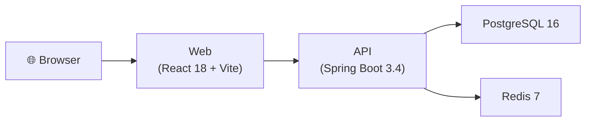

# HookWatch 🪝

> Webhook delivery platform with real-time trace visualization.


## Architecture



## Quick Start

**Prerequisites:** Docker + Make

```bash
git clone git@github.com:AdrianoVS87/hookwatch.git
cd hookwatch
make up
```

- API: http://localhost:8080
- Web: http://localhost:3000
- Swagger UI: http://localhost:8080/swagger-ui.html

### Other commands

```bash
make logs      # tail all service logs
make build     # rebuild images
make down      # stop services
make clean     # stop + remove volumes
```

## Screenshots

> [screenshots coming soon]

## Development

### Backend

```bash
cd api
mvn spring-boot:run -Dspring-boot.run.profiles=dev
```

### Frontend

```bash
cd web
npm install
npm run dev
```

## Contributing

1. Fork the repository
2. Create a feature branch: `git checkout -b feat/your-feature`
3. Follow [Conventional Commits](https://www.conventionalcommits.org/):
   - `feat(scope): description`
   - `fix(scope): description`
   - `docs: description`
   - `chore(scope): description`
4. Open a Pull Request targeting `main`

## License

MIT © 2026 Adriano Viera dos Santos
