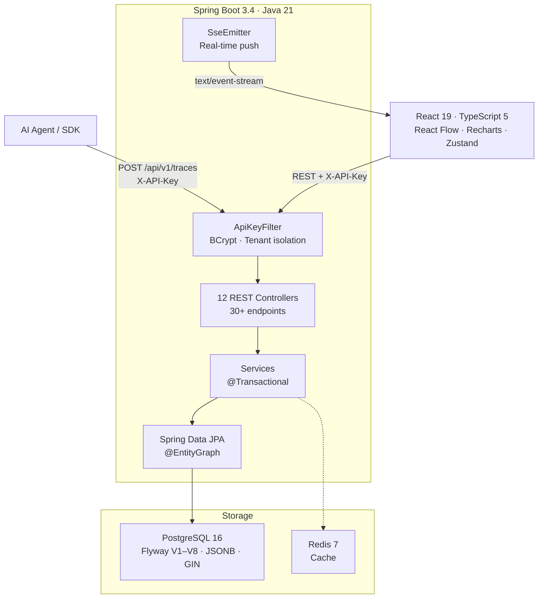

# HookWatch

> Observability platform for AI agent execution — trace every LLM call, tool invocation, and retrieval step in real time.

[](https://github.com/AdrianoVS87/hookwatch/actions/workflows/ci.yml)
[](https://github.com/AdrianoVS87/hookwatch/actions/workflows/deploy.yml)
[](api/src/test/java/com/HookWatch/)
[](https://openjdk.org/projects/jdk/21/)
[](https://spring.io/projects/spring-boot)
[](https://react.dev)
[](https://www.typescriptlang.org)
[](https://www.postgresql.org)
[](LICENSE)

**[Live Demo](https://hookwatch-one.vercel.app)** · **[API Reference](docs/API.md)**

---

## What is HookWatch?

HookWatch is a REST API + dashboard for recording and analyzing AI agent execution traces. Agents submit traces containing nested spans (LLM calls, tool invocations, retrieval steps) via a single POST request. Each span captures token counts, costs, latency, model used, and full I/O payloads.

The React frontend renders traces as interactive directed acyclic graphs using React Flow, streams live updates via Server-Sent Events, and provides cost analytics with per-model breakdowns — all scoped to isolated tenants via BCrypt-hashed API keys.

---

## Architecture



---

## Key Features

| Feature | Description |
|---------|-------------|
| **Trace ingestion** | Single POST creates a trace with nested spans — each span typed as `LLM_CALL`, `TOOL_CALL`, `RETRIEVAL`, or `CUSTOM` |
| **Execution graph** | Interactive DAG with Dagre auto-layout, color-coded by span type, red border on `FAILED`, pulse animation on `RUNNING` |
| **Real-time streaming** | Server-Sent Events push new spans to the canvas — no polling, auto-reconnect via `EventSource` |
| **Cost analytics** | Daily usage, per-model cost breakdown, cost trend vs. previous period, projected monthly cost (Recharts) |
| **Learning velocity** | Per-model metrics: success rate, cost-per-successful-trace, repeat failure rate, memory hit rate |
| **Failure fingerprinting** | SHA-256 hash of `(error + span_type + model)` — tracks recurring failure patterns with occurrence trends |
| **OTel compliance** | Validates W3C `traceparent`, resource attributes, and span attributes — compliance badges per trace |
| **Auto-evaluation** | Score traces with `NUMERIC`, `CATEGORICAL`, or `BOOLEAN` values via API or LLM judge |
| **Memory lineage** | Tracks retrieval spans per trace to show which memory sources influenced the agent's output |
| **Trace comparison** | Side-by-side diff of two traces with token/cost/latency/span deltas |
| **p95 latency** | Real `percentile_cont(0.95)` calculation via PostgreSQL — not approximated |
| **Multi-tenant** | BCrypt-hashed API keys, tenant-scoped data access via `ThreadLocal` context, cross-tenant access blocked |
| **Replay** | Scrub through spans in temporal order with play/pause/speed controls |
| **Command palette** | `⌘K` fuzzy search across agents and traces |

---

## Tech Stack

| Layer | Technology |
|-------|------------|
| **Backend** | Java 21 (virtual threads), Spring Boot 3.4, Spring Data JPA, Maven |
| **Frontend** | React 19, TypeScript 5.9 (strict, zero `any`), Vite 8, Zustand, React Flow, Recharts |
| **Database** | PostgreSQL 16 — Flyway migrations (V1–V8), JSONB metadata, `text[]` tags with GIN index |
| **Cache** | Redis 7 |
| **Auth** | X-API-Key header → BCrypt hash comparison → tenant context isolation |
| **Testing** | JUnit 5, Testcontainers (real PostgreSQL 16), Playwright (e2e), JaCoCo |
| **API Docs** | springdoc-openapi 2.6 → Swagger UI + OpenAPI 3.0 JSON |
| **CI/CD** | GitHub Actions → `mvn verify` + `npm run build` → SSH deploy with health check + rollback |
| **Infra** | Docker multi-stage build (JDK → JRE), Docker Compose with health checks |

---

## Quick Start

**Prerequisites:** Docker + Docker Compose v2

```bash
git clone git@github.com:AdrianoVS87/hookwatch.git
cd HookWatch
make up          # Builds and starts all 4 services
```

Once healthy, open:

| Service | URL |
|---------|-----|
| Dashboard | http://localhost:3001 |
| API | http://localhost:8085 |
| Swagger UI | http://localhost:8085/swagger-ui/index.html |

Demo data is seeded automatically via Flyway V7: 3 agents, ~500 traces with realistic multi-model distribution and pricing.

### Submit a trace

```bash
curl -s http://localhost:8085/api/v1/agents \
  -H "X-API-Key: demo-key-hookwatch" | jq '.[0].id'
# Copy the agent ID, then:

curl -X POST http://localhost:8085/api/v1/traces \
  -H "X-API-Key: demo-key-hookwatch" \
  -H "Content-Type: application/json" \
  -d '{
    "agentId": "<agent-id>",
    "status": "COMPLETED",
    "totalTokens": 1200,
    "totalCost": 0.018,
    "spans": [
      {
        "name": "web_search",
        "type": "TOOL_CALL",
        "status": "COMPLETED",
        "sortOrder": 0
      },
      {
        "name": "claude-sonnet-completion",
        "type": "LLM_CALL",
        "status": "COMPLETED",
        "model": "claude-sonnet-4-6",
        "inputTokens": 400,
        "outputTokens": 800,
        "cost": 0.018,
        "sortOrder": 1
      }
    ]
  }'
```

---

## Running Tests

```bash
cd api
mvn test    # 58 integration tests, ~3 min
```

All tests run against a real PostgreSQL 16 instance via **Testcontainers** — not H2 mocks.

| Test Suite | Tests | What it validates |
|-----------|-------|-------------------|
| AnalyticsIntegrationTest | 10 | Daily usage, model breakdown, cost trends, learning velocity, compliance |
| OtelExportIntegrationTest | 9 | OTLP JSON export, ingest, roundtrip conversion |
| ScoreIntegrationTest | 7 | Score CRUD, auto-evaluation, summary aggregation |
| TraceIngestionIntegrationTest | 4 | Create trace with spans, validation, status transitions |
| TraceComparisonIntegrationTest | 4 | Side-by-side delta calculation |
| ApiKeyAuthIntegrationTest | 4 | BCrypt matching, missing key, invalid key |
| TenantIsolationIntegrationTest | 3 | Cross-tenant data access blocked (403) |
| OtelComplianceIntegrationTest | 3 | Gap detection, traceparent validation |
| PaginationIntegrationTest | 3 | Page size, sorting, offset |
| TraceTagsAndAnnotationsIntegrationTest | 3 | Tag normalization, annotation CRUD |
| + 5 more test classes | 8 | Repository, controller, fingerprint, lineage, context load |

Frontend: 3 Playwright e2e tests (dashboard, compliance, fingerprints).

---

## API Overview

30+ endpoints across 12 controllers. Full reference with curl examples: [`docs/API.md`](docs/API.md)

| Method | Endpoint | Description |
|--------|----------|-------------|
| `POST` | `/api/v1/traces` | Submit trace with nested spans |
| `GET` | `/api/v1/traces?agentId=&tag=` | List traces (paginated, filterable by tag) |
| `GET` | `/api/v1/traces/{id}` | Get trace with all spans |
| `GET` | `/api/v1/traces/{id}/stream` | SSE real-time span updates |
| `GET` | `/api/v1/traces/compare` | Side-by-side trace diff |
| `GET` | `/api/v1/analytics` | Cost analytics, learning velocity, compliance |
| `GET` | `/api/v1/agents/{id}/metrics` | Agent metrics (incl. p95 latency) |
| `POST` | `/api/v1/traces/{id}/scores` | Score a trace (numeric/categorical/boolean) |
| `GET` | `/api/v1/fingerprints` | Failure pattern trends |
| `GET` | `/api/v1/traces/{id}/otel` | Export as OTLP JSON |
| `POST` | `/api/v1/ingest/otel` | Ingest OTLP trace |

Interactive API docs available at `/swagger-ui/index.html` when running locally.

---

## Project Structure

```
HookWatch/
├── api/                        # Spring Boot 3.4 — 12 controllers, 10 services, 8 entities
│   ├── src/main/java/          # controller/ domain/ dto/ filter/ repository/ security/ service/
│   ├── src/main/resources/     # application.yml (dev + docker) · db/migration/ (V1–V8)
│   ├── src/test/java/          # 15 test classes · Testcontainers PostgreSQL
│   └── Dockerfile              # Multi-stage: JDK build → JRE runtime
├── web/                        # React 19 + TypeScript 5 + Vite 8
│   └── src/                    # api/ components/ pages/ stores/ hooks/ types/
├── docs/adr/                   # 5 Architecture Decision Records
├── .github/workflows/ci.yml    # Backend test + frontend build + deploy
├── docker-compose.yml          # PostgreSQL 16, Redis 7, API, Web
└── Makefile                    # up / down / deploy / rollback
```

---

## Architecture Decisions

Each major decision is documented with context, alternatives evaluated, and trade-offs:

| ADR | Decision | Rationale |
|-----|----------|-----------|
| [ADR-0001](docs/adr/0001-use-spring-boot-java21.md) | Spring Boot 3.4 + Java 21 | Virtual threads for near-reactive throughput with blocking JDBC |
| [ADR-0002](docs/adr/0002-sse-over-websocket.md) | SSE over WebSocket | Unidirectional push is sufficient; no broker infrastructure needed |
| [ADR-0003](docs/adr/0003-flyway-schema-migrations.md) | Flyway migrations | Schema-as-code; CI-validated; Hibernate set to `validate` only |
| [ADR-0004](docs/adr/0004-xapikey-authentication.md) | X-API-Key authentication | BCrypt-hashed, per-tenant scoped, O(1) lookup via UUID prefix |
| [ADR-0005](docs/adr/0005-react-flow-dagre-layout.md) | React Flow + Dagre | Deterministic DAG layout with interactive custom nodes |

---

## Database Schema

8 tables managed by Flyway migrations (V1–V8):

```
tenants              agents               traces               spans
├── id (PK)          ├── id (PK)          ├── id (PK)          ├── id (PK)
├── name             ├── tenant_id (FK)   ├── agent_id (FK)    ├── trace_id (FK)
├── api_key (BCrypt) ├── name             ├── status            ├── parent_span_id
└── created_at       ├── description      ├── total_tokens      ├── name, type, status
                     └── created_at       ├── total_cost        ├── input/output_tokens
                                          ├── metadata (JSONB)  ├── cost, model
                                          ├── tags (text[], GIN)├── input, output, error
                                          └── started/completed └── sort_order

scores               annotations          failure_fingerprints  webhooks
├── id (PK)          ├── id (PK)          ├── id (PK)           ├── id (PK)
├── trace_id (FK)    ├── trace_id (FK)    ├── tenant_id (FK)    ├── name
├── name, data_type  ├── text             ├── agent_id (FK)     ├── target_url
├── numeric/string/  ├── author           ├── hash (SHA-256)    ├── status
│   boolean_value    └── created_at       ├── error_message     └── created_at
├── source (API/                          ├── occurrence_count
│   MANUAL/LLM_JUDGE)                    └── first/last_seen_at
└── created_at
```

---

## Live Demo

| | URL |
|-|-----|
| **Frontend** | https://hookwatch-one.vercel.app |
| **Backend API** | https://hookwatch.adrianovs.net |

---

## Contributing

See [`CONTRIBUTING.md`](CONTRIBUTING.md) for development setup, branching strategy, and commit conventions.

---

## Roadmap

- [ ] JWT short-lived tokens for SSE endpoint authentication
- [ ] Redis Pub/Sub for horizontal SSE scaling across multiple pods
- [ ] Rate limiting on public endpoints (Bucket4j)
- [ ] OpenTelemetry SDK integration for auto-instrumentation

---

## License

MIT © 2026 [Adriano Viera dos Santos](https://github.com/AdrianoVS87)
