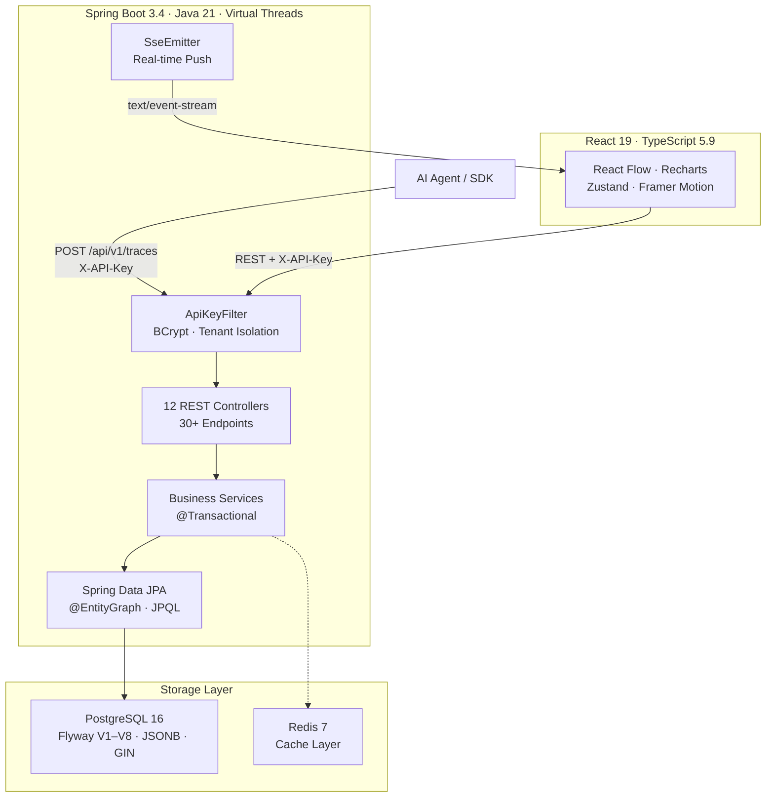
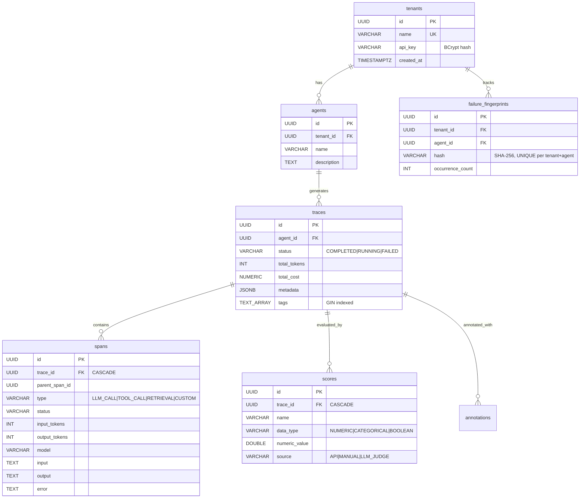

# HookWatch

> **Production-grade observability platform for AI agent execution traces.**
> Ingest, visualize, and analyze every LLM call, tool invocation, and retrieval step — in real time.

[](https://github.com/AdrianoVS87/hookwatch/actions/workflows/ci.yml)
[](api/src/test/java/com/HookWatch/)
[](https://openjdk.org/projects/jdk/21/)
[](https://spring.io/projects/spring-boot)
[](https://react.dev)
[](https://www.typescriptlang.org)
[](https://www.postgresql.org)
[](LICENSE)

**[Live Demo](https://hookwatch-one.vercel.app)** · **[API Reference](docs/API.md)** · **[Architecture Decisions](docs/adr/)**

> **Screenshots:** see [`docs/screenshots/`](docs/screenshots/) — pending addition.

---

## Why HookWatch?

Modern AI agents make hundreds of decisions per execution: calling LLMs, invoking tools, retrieving context from vector stores. When something goes wrong — hallucinations, cost overruns, silent failures — engineers need more than raw JSON logs. HookWatch provides structured trace ingestion, interactive execution graphs, real-time streaming, and cost analytics designed specifically for debugging and optimizing agent behavior.

**Built for:** platform engineers, ML ops teams, and AI developers who ship production agent systems and need observability beyond print statements.

---

## Key Features

| Feature | Description |
|---------|-------------|
| **Trace Ingestion** | Single POST creates a trace with nested spans — typed as `LLM_CALL`, `TOOL_CALL`, `RETRIEVAL`, or `CUSTOM` |
| **Execution Graph** | Interactive DAG (React Flow + Dagre) with color-coded span types, red border on `FAILED`, pulse on `RUNNING` |
| **Real-Time Streaming** | Server-Sent Events push live span updates — no polling, auto-reconnect via `EventSource` |
| **Cost Analytics** | Daily token/cost trends, per-model breakdown, projected monthly cost (Recharts dashboards) |
| **Learning Velocity** | Per-model success rate, cost-per-successful-trace, repeat failure rate, memory hit rate |
| **Failure Fingerprinting** | SHA-256 hash of `(error + span_type + model)` — tracks recurring patterns with sparkline trends |
| **OTel Compliance** | Validates W3C `traceparent`, resource attributes, span attributes — compliance badge per trace |
| **Trace Scoring** | Score traces with `NUMERIC`, `CATEGORICAL`, or `BOOLEAN` values via API or auto-eval |
| **Memory Lineage** | Tracks retrieval spans to show which memory sources influenced agent output |
| **Trace Comparison** | Side-by-side diff with token/cost/latency/span deltas — green = improvement, red = regression |
| **Multi-Tenant** | BCrypt-hashed API keys, tenant-scoped data access via `ThreadLocal`, cross-tenant access blocked |
| **Command Palette** | `⌘K` fuzzy search across agents and traces |

---

## Architecture



### Design Principles

- **Virtual threads** (Java 21) for near-reactive throughput with blocking JDBC — no reactive complexity
- **Tenant isolation** enforced at the filter layer — every query is scoped by tenant ID
- **Schema-as-code** — Flyway manages all 8 migrations; Hibernate is `validate` only
- **Real p95 latency** — PostgreSQL `percentile_cont(0.95)`, not approximated

---

## Tech Stack

| Layer | Technology | Why |
|-------|------------|-----|
| **Backend** | Java 21, Spring Boot 3.4, Spring Data JPA, Maven | Virtual threads, mature ecosystem, type safety |
| **Frontend** | React 19, TypeScript 5.9 (strict), Vite 8, Zustand 5, React Flow 12, Recharts 3 | Fast builds, strong typing, composable state |
| **Database** | PostgreSQL 16 — Flyway V1–V8, JSONB metadata, `text[]` tags with GIN index | Complex queries, array ops, percentile functions |
| **Cache** | Redis 7 | Session caching, rate limit support |
| **Auth** | X-API-Key → BCrypt hash → tenant context (ThreadLocal) | Simple M2M auth, O(1) lookup via UUID prefix |
| **Testing** | JUnit 5, Testcontainers (PostgreSQL 16), Playwright, JaCoCo | Real database tests, not mocks |
| **CI/CD** | GitHub Actions → `mvn verify` + `npm run build` → SSH deploy + health check | Automated with rollback on failure |
| **Infra** | Docker multi-stage (JDK → JRE), Docker Compose, nginx reverse proxy | Minimal images, non-root user |

---

## Quick Start

**Prerequisites:** Docker + Docker Compose v2

```bash
git clone git@github.com:AdrianoVS87/hookwatch.git
cd HookWatch
make up          # Builds and starts PostgreSQL, Redis, API, Web
```

| Service | URL |
|---------|-----|
| Dashboard | http://localhost:3001 |
| API | http://localhost:8085 |
| Swagger UI | http://localhost:8085/swagger-ui/index.html |

Demo data is seeded automatically: 3 agents, ~500 traces with realistic multi-model distribution and pricing.

### Submit a Trace

```bash
# Get an agent ID
AGENT_ID=$(curl -s http://localhost:8085/api/v1/agents \
  -H "X-API-Key: demo-key-hookwatch" | jq -r '.[0].id')

# Submit a trace with two spans
curl -X POST http://localhost:8085/api/v1/traces \
  -H "X-API-Key: demo-key-hookwatch" \
  -H "Content-Type: application/json" \
  -d '{
    "agentId": "'$AGENT_ID'",
    "status": "COMPLETED",
    "totalTokens": 1200,
    "totalCost": 0.018,
    "spans": [
      {
        "name": "web_search",
        "type": "TOOL_CALL",
        "status": "COMPLETED",
        "sortOrder": 0
      },
      {
        "name": "claude-sonnet-completion",
        "type": "LLM_CALL",
        "status": "COMPLETED",
        "model": "claude-sonnet-4-6",
        "inputTokens": 400,
        "outputTokens": 800,
        "cost": 0.018,
        "sortOrder": 1
      }
    ]
  }'
```

---

## Database Schema

8 tables managed by Flyway migrations (V1–V8):



---

## API Overview

30+ endpoints across 12 controllers. Full reference: [`docs/API.md`](docs/API.md)

| Method | Endpoint | Description |
|--------|----------|-------------|
| `POST` | `/api/v1/tenants` | Create tenant (returns API key) |
| `POST` | `/api/v1/traces` | Submit trace with nested spans |
| `GET` | `/api/v1/traces?agentId=&tag=` | List traces (paginated, filterable) |
| `GET` | `/api/v1/traces/{id}` | Get trace with all spans |
| `GET` | `/api/v1/traces/{id}/stream` | SSE real-time span updates |
| `GET` | `/api/v1/traces/compare` | Side-by-side trace diff |
| `GET` | `/api/v1/analytics` | Cost analytics + learning velocity |
| `GET` | `/api/v1/agents/{id}/metrics` | Agent metrics (incl. real p95 latency) |
| `POST` | `/api/v1/traces/{id}/scores` | Score a trace |
| `GET` | `/api/v1/fingerprints` | Failure pattern tracking |
| `GET` | `/api/v1/traces/{id}/otel` | Export as OTLP JSON |
| `POST` | `/api/v1/ingest/otel` | Ingest OTLP trace |
| `GET` | `/api/v1/traces/{id}/compliance` | OTel compliance report |

Interactive API docs: `/swagger-ui/index.html`

---

## Testing

**58 tests, 0 failures** — all integration tests run against real PostgreSQL 16 via **Testcontainers**.

```bash
cd api && mvn test
```

| Test Suite | Tests | Coverage |
|-----------|-------|----------|
| AnalyticsIntegrationTest | 10 | Daily usage, model breakdown, cost trends, learning velocity, compliance summary |
| OtelExportIntegrationTest | 9 | OTLP JSON export/ingest, roundtrip, error cases |
| ScoreIntegrationTest | 7 | CRUD, auto-eval, summary aggregation, cross-tenant blocked |
| TraceIngestionIntegrationTest | 4 | Create with spans, validation, status transitions |
| TraceComparisonIntegrationTest | 4 | Delta calculation, span-by-span diff, cross-tenant blocked |
| ApiKeyAuthIntegrationTest | 4 | BCrypt matching, missing key, invalid key |
| TenantIsolationIntegrationTest | 3 | Cross-tenant access returns 403 |
| PaginationIntegrationTest | 3 | Page size, sorting, offset |
| OtelComplianceIntegrationTest | 3 | Gap detection, traceparent validation |
| TraceTagsAndAnnotationsIntegrationTest | 3 | Tag merge/delete, annotation CRUD |
| + 5 more | 8 | Repository, controller, fingerprint, lineage, context |

Frontend: 3 Playwright e2e tests (Chromium).

---

## Project Structure

```
hookwatch/
├── api/                           # Spring Boot 3.4 backend
│   ├── src/main/java/
│   │   ├── config/                # AppConfig, DataSeeder, OpenApiConfig
│   │   ├── controller/            # 12 REST controllers
│   │   ├── domain/                # 8 JPA entities
│   │   ├── dto/                   # Request/response DTOs (Jakarta validation)
│   │   ├── exception/             # GlobalExceptionHandler (RFC 7807)
│   │   ├── filter/                # ApiKeyFilter (BCrypt, tenant isolation)
│   │   ├── repository/            # Spring Data JPA (JPQL + native SQL)
│   │   ├── security/              # TenantContext (ThreadLocal<UUID>)
│   │   └── service/               # Business logic (10 services)
│   ├── src/main/resources/
│   │   ├── application.yml        # Profiles: dev, docker
│   │   └── db/migration/          # Flyway V1–V8
│   ├── src/test/java/             # 15 test classes, 58 tests
│   └── Dockerfile                 # Multi-stage: JDK → JRE (eclipse-temurin:21)
├── web/                           # React 19 + TypeScript 5.9
│   └── src/
│       ├── api/                   # Axios client + endpoint modules
│       ├── components/            # TraceCanvas, SpanNode, SpanDetail, MetricsBar, etc.
│       ├── pages/                 # Dashboard, TraceView, Analytics, Compare, Fingerprints, Settings
│       ├── stores/                # Zustand (5 stores)
│       ├── hooks/                 # useTraceStream (SSE)
│       └── types/                 # Full TypeScript definitions
├── docs/
│   ├── adr/                       # 5 Architecture Decision Records
│   ├── API.md                     # Full API reference with curl examples
│   └── screenshots/               # UI screenshots (pending)
├── .github/workflows/ci.yml       # CI: test + build + deploy
├── docker-compose.yml             # PostgreSQL, Redis, API, Web
└── Makefile                       # up / down / deploy / rollback
```

---

## Architecture Decisions

| ADR | Decision | Rationale |
|-----|----------|-----------|
| [ADR-0001](docs/adr/0001-use-spring-boot-java21.md) | Spring Boot 3.4 + Java 21 | Virtual threads for blocking JDBC with near-reactive throughput |
| [ADR-0002](docs/adr/0002-sse-over-websocket.md) | SSE over WebSocket | Unidirectional push, no broker, HTTP/2 multiplexing |
| [ADR-0003](docs/adr/0003-flyway-schema-migrations.md) | Flyway migrations | Schema-as-code, CI-validated, auditable in Git |
| [ADR-0004](docs/adr/0004-xapikey-authentication.md) | X-API-Key auth | BCrypt-hashed, tenant-scoped, O(1) lookup via UUID prefix |
| [ADR-0005](docs/adr/0005-react-flow-dagre-layout.md) | React Flow + Dagre | Deterministic DAG layout with interactive custom nodes |

---

## Live Demo

| | URL |
|-|-----|
| **Frontend** | https://hookwatch-one.vercel.app |
| **Backend API** | https://hookwatch.adrianovs.net |
| **Swagger UI** | https://hookwatch.adrianovs.net/swagger-ui/index.html |

---

## Roadmap

- [ ] JWT short-lived tokens for SSE endpoint authentication
- [ ] Redis Pub/Sub for horizontal SSE scaling across multiple pods
- [ ] Rate limiting on public endpoints (Bucket4j)
- [ ] OpenTelemetry SDK integration for auto-instrumentation
- [ ] Frontend component tests (Vitest + Testing Library)

---

## Contributing

See [`CONTRIBUTING.md`](CONTRIBUTING.md) for development setup, branching strategy, and commit conventions.

---

## License

MIT © 2026 [Adriano Viera dos Santos](https://github.com/AdrianoVS87)
