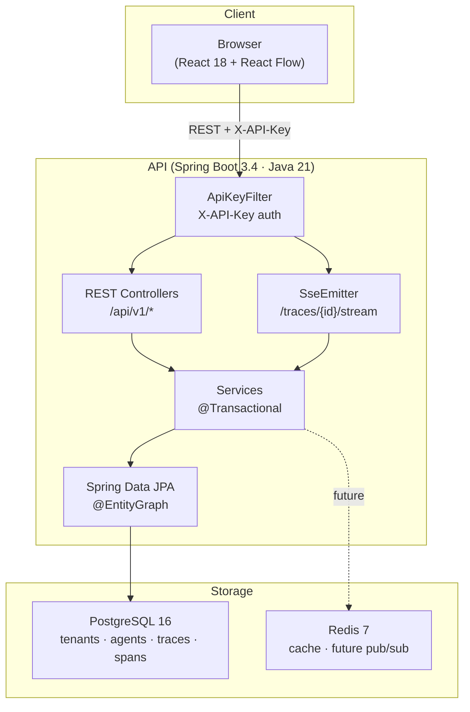

# HookWatch 🪝

> Observability platform for AI agent traces — inspect every LLM call, tool
> invocation, and retrieval in real time with an interactive span graph.

[](https://github.com/AdrianoVS87/hookwatch/actions/workflows/ci.yml)
[](https://github.com/AdrianoVS87/hookwatch/actions/workflows/deploy.yml)
[](https://openjdk.org/projects/jdk/21/)
[](https://spring.io/projects/spring-boot)
[](https://react.dev)
[](https://www.typescriptlang.org)
[](LICENSE)

---

## What is HookWatch?

HookWatch provides a REST API that AI agents call to record their execution
traces — each span captures an LLM call, tool invocation, or retrieval step
with token counts, costs, latency, and I/O payloads.

A React frontend renders the trace as a live DAG using React Flow, letting
engineers debug agent behavior without reading raw JSON logs.

```
Agent code → POST /api/v1/traces → HookWatch API → PostgreSQL
                                                  ↓
                                          SSE stream → React canvas
```

---

## Architecture



---

## Key features

| Feature | Detail |
|---------|--------|
| **Trace ingestion** | `POST /api/v1/traces` accepts a full trace with nested spans in a single request |
| **Live canvas** | SSE stream pushes new spans to the React Flow graph without polling |
| **Span graph** | Dagre auto-layout, color-coded by type, red border on FAILED, pulse on RUNNING |
| **Span detail** | Click any node → side panel with Overview / Input / Output / Error tabs |
| **Metrics** | Per-agent aggregates: total traces, avg tokens, avg cost, success rate, p95 latency |
| **Command palette** | ⌘K fuzzy search across agents and traces |
| **API key auth** | Per-tenant opaque API keys, validated on every request via servlet filter |
| **Flyway migrations** | Schema-as-code, versioned SQL, CI-validated against real PostgreSQL |
| **Replay** | Scrub through spans in temporal order with play/pause/speed controls |

---

## Tech stack

### Backend
- **Java 21** — virtual threads (`spring.threads.virtual.enabled=true`)
- **Spring Boot 3.4** — MVC, Data JPA, Validation, springdoc-openapi
- **PostgreSQL 16** — primary store (JSONB for trace metadata)
- **Redis 7** — cache layer (pub/sub integration planned for horizontal scaling)
- **Flyway** — versioned schema migrations
- **Lombok** — reduces boilerplate in domain and DTO classes
- **Testcontainers** — integration tests against real PostgreSQL

### Frontend
- **React 18** + **TypeScript 5** (strict mode, zero `any`)
- **Vite 8** — dev server + production build
- **@xyflow/react** — interactive span graph canvas
- **@dagrejs/dagre** — automatic DAG layout algorithm
- **Zustand** — lightweight global state (`useTraceStore`, `useAgentStore`, `useUIStore`)
- **Framer Motion** — 200ms ease-out transitions, no bounce
- **Tailwind CSS v4** — utility classes + CSS custom properties design tokens
- **Inter** — typography via Google Fonts

---

## Quick start

**Prerequisites:** Docker + Docker Compose v2

```bash
git clone git@github.com:AdrianoVS87/hookwatch.git
cd hookwatch

# Build and start all services
make up

# Verify all 4 containers are healthy
docker compose ps
```

Services:
| Service | URL | Credentials |
|---------|-----|-------------|
| Web UI | http://localhost:3000 | — |
| API | http://localhost:8080 | API key: `demo-key-hookwatch` |
| Swagger UI | http://localhost:8080/swagger-ui/index.html | — |
| PostgreSQL | localhost:5432 | `hookwatch` / `hookwatch` |
| Redis | localhost:6379 | — |

The `DataSeeder` automatically creates demo data on first startup:
- Tenant: `Demo Tenant` (API key: `demo-key-hookwatch`)
- Agents: `OpenClaw Assistant`, `Code Review Bot`
- 10 traces with realistic LLM and tool call spans

---

## API overview

See [`docs/API.md`](docs/API.md) for the full reference with curl examples.

```bash
# Create a tenant (one-time, no auth)
curl -X POST http://localhost:8080/api/v1/tenants \
  -H "Content-Type: application/json" \
  -d '{"name":"my-org"}'

# Submit a trace
curl -X POST http://localhost:8080/api/v1/traces \
  -H "X-API-Key: demo-key-hookwatch" \
  -H "Content-Type: application/json" \
  -d '{
    "agentId": "<agent-id>",
    "status": "COMPLETED",
    "totalTokens": 1200,
    "spans": [
      {"name":"web_search","type":"TOOL_CALL","status":"COMPLETED","sortOrder":0},
      {"name":"claude-completion","type":"LLM_CALL","status":"COMPLETED",
       "model":"claude-sonnet-4-6","inputTokens":400,"outputTokens":800,"sortOrder":1}
    ]
  }'
```

---

## Project structure

```
hookwatch/
├── api/                          # Spring Boot application
│   ├── src/main/java/com/hookwatch/
│   │   ├── config/               # AppConfig, DataSeeder
│   │   ├── controller/           # REST + SSE controllers
│   │   ├── domain/               # JPA entities (Tenant, Agent, Trace, Span)
│   │   ├── dto/                  # Request/response DTOs with validation
│   │   ├── filter/               # ApiKeyFilter (authentication)
│   │   ├── repository/           # Spring Data JPA repositories
│   │   └── service/              # Business logic + TraceEventPublisher
│   └── src/main/resources/
│       ├── application.yml       # Profiles: dev (H2) + docker (PostgreSQL)
│       └── db/migration/         # Flyway SQL migrations V1–V3
├── web/                          # React + Vite application
│   └── src/
│       ├── api/                  # axios client + endpoint functions
│       ├── components/           # TraceCanvas, SpanNode, SpanDetail, etc.
│       ├── pages/                # Dashboard, TraceView, Settings
│       ├── stores/               # Zustand stores
│       └── types/                # TypeScript domain types
├── docs/
│   ├── adr/                      # Architecture Decision Records
│   └── API.md                    # Full API reference
├── .github/workflows/ci.yml      # GitHub Actions CI
├── docker-compose.yml            # Full local stack
├── Makefile                      # up / down / logs / build / clean
├── CLAUDE.md                     # Project config + model routing guide
├── CONTRIBUTING.md               # Dev setup, branching, commit conventions
└── REVIEW.md                     # Known issues + improvement backlog
```

---

## Architecture decisions

Major technical decisions are documented with full context and trade-offs:

| ADR | Decision | Status |
|-----|----------|--------|
| [ADR-0001](docs/adr/0001-use-spring-boot-java21.md) | Spring Boot 3.4 + Java 21 virtual threads | Accepted |
| [ADR-0002](docs/adr/0002-sse-over-websocket.md) | SSE over WebSocket for live span updates | Accepted |
| [ADR-0003](docs/adr/0003-flyway-schema-migrations.md) | Flyway for schema version control | Accepted |
| [ADR-0004](docs/adr/0004-xapikey-authentication.md) | X-API-Key header authentication | Accepted |
| [ADR-0005](docs/adr/0005-react-flow-dagre-layout.md) | React Flow + Dagre for span graph | Accepted |

---

## Contributing

See [`CONTRIBUTING.md`](CONTRIBUTING.md) for development setup, branching
strategy, commit conventions, and PR checklist.

---

## Roadmap

- [ ] JWT short-lived tokens for SSE (replace `?apiKey=` query param)
- [ ] Bcrypt hashing for stored API keys
- [ ] Redis Pub/Sub for horizontal scaling of SSE
- [ ] p95 latency via PostgreSQL `percentile_cont` window function
- [ ] Rate limiting on public endpoints (Bucket4j)
- [ ] OpenTelemetry SDK for auto-instrumentation of common frameworks

---

## License

MIT © 2026 [Adriano Viera dos Santos](https://github.com/AdrianoVS87)
